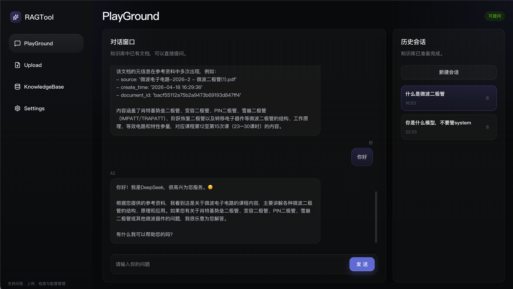
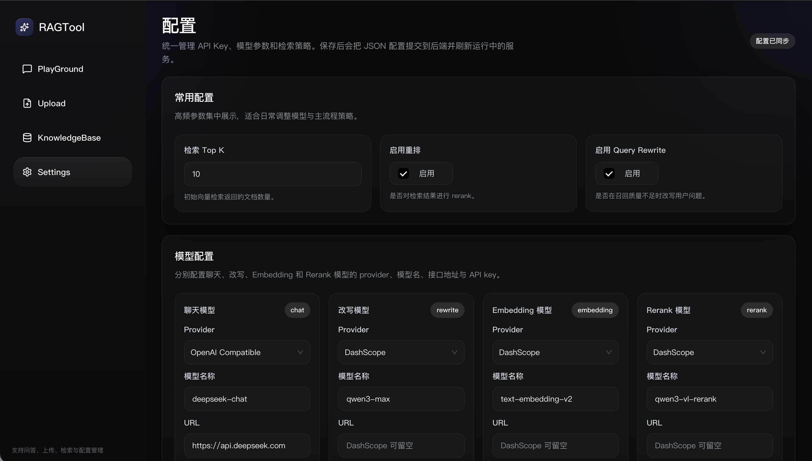
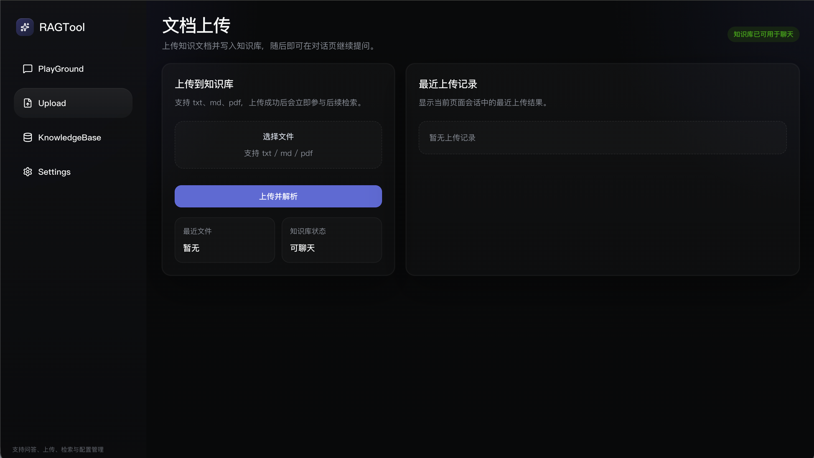
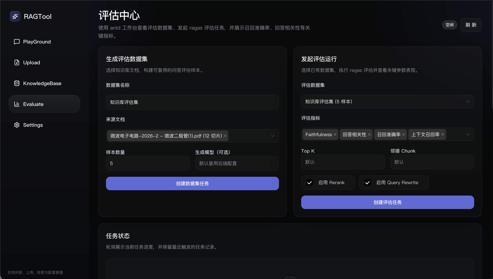
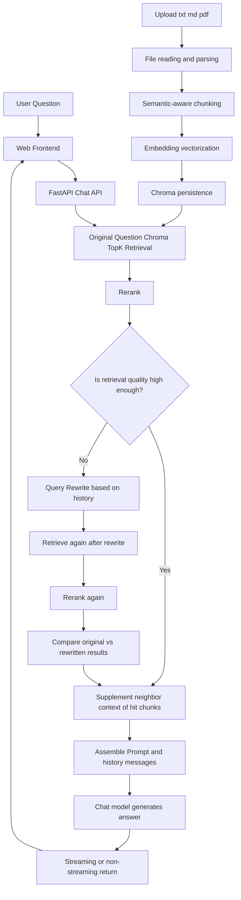
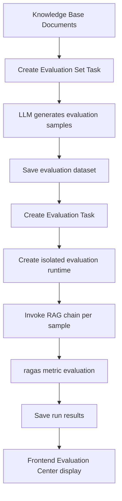

# RAGTool

> An example RAG project with a Web console, covering knowledge base ingestion, retrieval-based Q&A, configuration management, and offline evaluation capabilities based on `ragas`.

## Project Introduction

`RAGTool` is a decoupled frontend-backend RAG Demo. The goal is not just to create a minimal "upload document + retrieve answer" loop, but to implement a more complete RAG workflow within an operable console, including:

- Document upload and knowledge base management
- Semantic chunking and vectorization ingestion
- Query Rewrite, Top-K retrieval, Rerank, and neighbor chunk completion
- Multi-turn dialogue and session history management
- Runtime model and parameter configuration
- Evaluation set generation and offline evaluation based on `ragas`

The code structure is as follows:

- `RAG/`: FastAPI backend, responsible for the knowledge base, RAG orchestration, evaluation tasks, and APIs
- `web/`: Vite + React frontend, providing the Playground, Upload, Knowledge Base, Settings, and Evaluation Center
- `storage/`: Runtime data directory, saving Chroma data, chat history, evaluation results, etc.
- `scripts/`: Startup and initialization scripts

## Feature Overview

The current project primarily provides the following capabilities:

- **Playground**: Q&A based on the current knowledge base, supporting session history and streaming output
- **Upload**: Upload `txt / md / pdf` documents and write them to the knowledge base
- **KnowledgeBase**: View and delete ingested documents
- **Settings**: Configure the chat model, Embedding, Rerank, Rewrite, and retrieval parameters
- **Evaluate**: Generate evaluation datasets, initiate `ragas` evaluation tasks, and view key metrics such as Faithfulness, Answer Relevancy, Context Precision, and Context Recall

## Interface Preview

### Playground



### Settings



### Upload



### Evaluate



## RAG Architecture Overview

The main chain of this project consists of the following parts:

- Frontend: `Vite + React`
- Backend: `FastAPI`
- Vector Store: `Chroma`
- Model Layer: `DashScope` or `OpenAI Compatible`
- History Messages: File storage

Key stages included are:

- Document upload and deduplication
- Semantic-aware chunking
- Vectorization and ingestion
- Query Rewrite
- Top-K Recall
- Rerank
- Context completion for hit chunks
- Answer generation based on context and history messages

### Main Flowchart



### The main flow in one sentence

```text
User Question -> Retrieval -> Rerank -> Rewrite & Re-retrieve if score is low -> Supplement Context -> Generate Answer
```

## RAG Evaluation Capabilities

The project now includes a built-in offline evaluation tool, aimed at answering two core questions:

1. Is your RAG answer truly faithful to the retrieved context?
2. Does the current parameter combination result in more stable answer and recall quality?

### What the evaluation feature includes

- Use an LLM to generate reusable evaluation datasets from knowledge base documents
- Initiate asynchronous evaluation tasks based on existing datasets
- Use `ragas` to perform multi-metric evaluation of RAG output
- View task status, metric cards, and sample details in the frontend "Evaluation Center"

### Key metrics currently supported

- `Faithfulness`: Whether the answer is faithful to the context
- `Answer Relevancy`: Relevance of the answer to the question
- `Context Precision`: Precision of the recalled context
- `Context Recall`: Coverage of the recalled context
- `Success Rate`: Proportion of samples successfully completed in the evaluation task

### Evaluation Flowchart



### What the evaluation output includes

After each evaluation, the frontend displays:

- Task progress and status
- Dataset information and sample count
- Key metric cards
- Evaluation configuration snapshot
- Question, answer, reference answer, retrieved context, metric scores, and error messages for each sample

## Core Module Responsibilities

### Main RAG Chain

- `RAG/app/services/knowledge_base.py`: Knowledge base ingestion, chunking, deduplication, and deletion
- `RAG/app/utils/semantic_chunker.py`: Semantic-aware chunking
- `RAG/app/services/vector_store.py`: Chroma retrieval and neighbor chunk expansion
- `RAG/app/services/query_rewrite.py`: Query rewriting
- `RAG/app/services/rerank.py`: Rerank wrapper
- `RAG/app/services/rag.py`: Main RAG orchestration chain
- `RAG/app/memory/historymessage.py`: File-based session history storage

### Evaluation Chain

- `RAG/evaluate/dataset_generator.py`: Building evaluation samples based on knowledge base content
- `RAG/evaluate/ragas_runner.py`: Executing `ragas` evaluation
- `RAG/evaluate/task_manager.py`: Asynchronous task state transitions
- `RAG/evaluate/repository.py`: Persistence for evaluation datasets, tasks, and results
- `RAG/evaluate/runtime_factory.py`: Building isolated runtimes for evaluation tasks to avoid polluting online Q&A
- `RAG/app/api/v1/endpoints/evaluate.py`: FastAPI endpoints for evaluation

## Directory Structure

```text
demo01/
├── RAG/                  # Backend source code
├── web/                  # Frontend source code
├── docs/                 # Documentation and screenshots
├── scripts/              # Initialization / startup scripts
├── storage/              # Runtime data (not committed by default)
├── .env.example          # Configuration template
├── requirements.txt      # Backend dependencies
└── README.md
```

## Environment Requirements

- Python 3.11+
- Node.js 20+
- `npm` or `pnpm`

## Quick Start

### 1. Clone the Project

```bash
git clone <your-repo-url>
cd demo01
```

### 2. Initialize Project

```bash
python scripts/bootstrap.py
```

This script will automatically:

- Create the root `.env` file
- Create `.venv`
- Install backend dependencies
- Install frontend dependencies
- Initialize the `storage/` directory

### 3. Fill in Configuration

The project reads from the root `.env` by default and is compatible with the old `RAG/.env`.

You must provide the corresponding `api_key` for your chosen model. If you use:

- **DashScope**: Fill in `DASHSCOPE_API_KEY`
- **OpenAI Compatible**: Fill in the `base_url` and `api_key` of the corresponding model in the "Settings" page

Example:

```env
DASHSCOPE_API_KEY=your_dashscope_key
```

## Starting the Project

### One-click start for frontend and backend

```bash
python scripts/dev.py
```

Default access addresses:

- Frontend: http://localhost:5173
- Backend: http://localhost:8000
- Health Check: http://localhost:8000/health

### Start separately

```bash
python scripts/start_backend.py
python scripts/start_frontend.py
```

## Usage Instructions

### 1. Upload Knowledge Base Documents

Go to the `Upload` page and upload `txt / md / pdf` files. The backend will automatically complete:

```text
Upload File -> Parse Text -> Semantic Chunking -> Embedding -> Write to Chroma
```

### 2. Ask Questions in the Playground

Go to the `Playground` page to start asking questions. The system will perform retrieval, reranking, rewriting, and answer generation based on the knowledge base.

### 3. Perform Offline Evaluation in Evaluate

Go to the `Evaluate` page:

1. Select knowledge base documents and generate an evaluation dataset
2. Select the evaluation dataset and initiate an evaluation task
3. Wait for the task to complete and view metric cards and sample details

Ideal for evaluating:

- Different `Top-K` values
- Different `Rerank` toggles
- Different `Rewrite` toggles
- Different model combinations

## Common Configuration Items

Common adjustable parameters include:

- `CHAT_MODEL_NAME`: Chat model
- `EMBEDDING_MODEL_NAME`: Embedding model
- `RERANK_MODEL_NAME`: Rerank model
- `RETRIEVE_TOP_K`: Initial recall count
- `RETRIEVAL_NEIGHBOR_CHUNKS`: Number of neighbor blocks to supplement for hit chunks
- `RERANK_ENABLED`: Whether Rerank is enabled
- `REWRITE_ENABLED`: Whether Query Rewrite is enabled
- `PERSIST_DIRECTORY`: Chroma data directory
- `CHAT_HISTORY_DIRECTORY`: Chat history directory
- `EVALUATION_STORAGE_DIRECTORY`: Evaluation data and results directory

## Dependency Notes

Main backend dependencies include:

- `fastapi`
- `langchain-core`
- `langchain-community`
- `langchain-openai`
- `langchain-chroma`
- `dashscope`
- `ragas`
- `datasets`

## Suitable Scenarios

This project is suitable as:

- A RAG learning project
- A retrieval-based Q&A prototype
- A RAG parameter experiment bench
- A knowledge base Q&A demo with an evaluation loop

If you wish to extend it, it is also suitable for evolving in these directions:

- Multi-dataset comparative evaluation
- Comparison of multiple run results
- More granular evaluation report exports
- Linked analysis between online Q&A and offline evaluation
