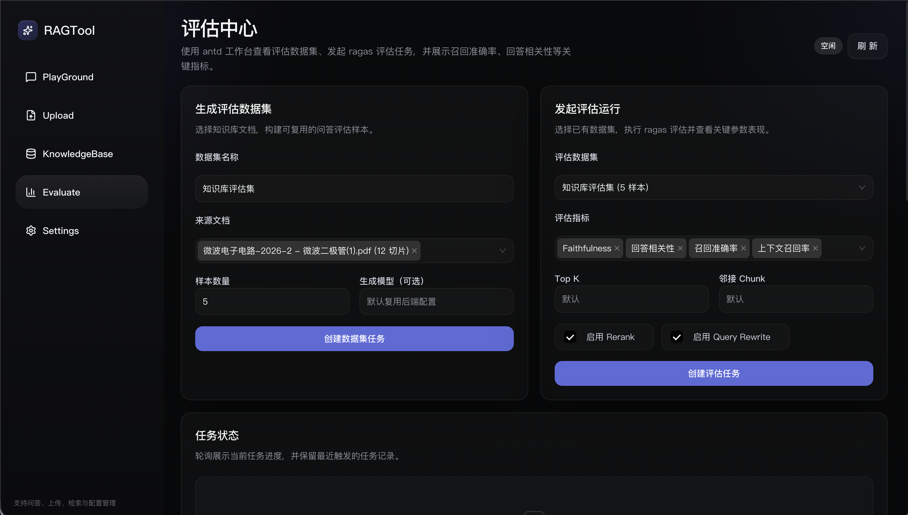
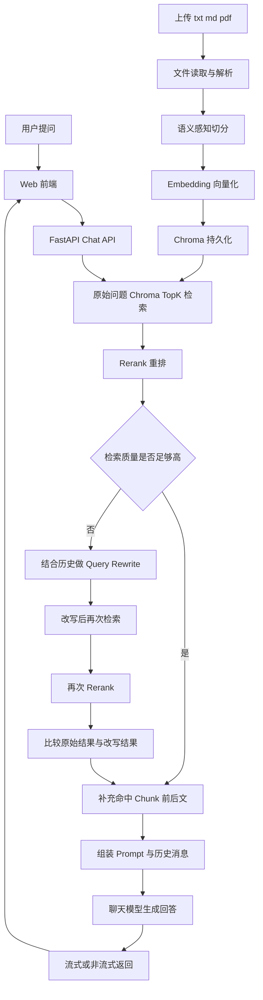
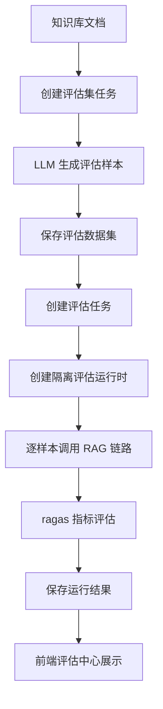

# RAGTool

> 一个带 Web 控制台的 RAG 示例项目，覆盖知识库入库、检索问答、配置管理，以及基于 `ragas` 的离线评估能力。

## 项目简介

`RAGTool` 是一个前后端分离的 RAG Demo，目标不是只做“上传文档 + 检索回答”的最小闭环，而是把一套更完整的 RAG 工作流落到可直接操作的控制台里，包括：

- 文档上传与知识库管理
- 语义切分与向量化入库
- Query Rewrite、Top-K 检索、Rerank、邻块补全
- 多轮对话与历史会话管理
- 运行时模型与参数配置
- 基于 `ragas` 的评估集生成与离线评估

代码结构如下：

- `RAG/`：FastAPI 后端，负责知识库、RAG 编排、评估任务与接口
- `web/`：Vite + React 前端，提供 Playground、上传、知识库、配置、评估中心
- `storage/`：运行时数据目录，保存 Chroma、聊天历史、评估结果等
- `scripts/`：启动、初始化脚本

## 功能概览

当前项目主要提供这几类能力：

- **Playground**：基于当前知识库进行问答，支持会话历史与流式输出
- **Upload**：上传 `txt / md / pdf` 文档并写入知识库
- **KnowledgeBase**：查看和删除已入库文档
- **Settings**：配置对话模型、Embedding、Rerank、Rewrite 及检索参数
- **Evaluate**：生成评估数据集，发起 `ragas` 评估任务，查看 Faithfulness、回答相关性、召回准确率、上下文召回率等关键指标

## 界面预览

### Playground


### Settings


### Upload


### Evaluate



## RAG 架构概览

这个项目的主链路由以下部分组成：

- 前端：`Vite + React`
- 后端：`FastAPI`
- 向量库：`Chroma`
- 模型层：`DashScope` 或 `OpenAI Compatible`
- 历史消息：文件存储

它包含的关键环节包括：

- 文档上传与去重
- 语义感知切分
- 向量化入库
- Query Rewrite
- Top-K 召回
- Rerank
- 命中 chunk 的前后文补齐
- 基于上下文与历史消息的回答生成

### 主链路流程图



### 一句话理解主流程

```text
用户问题 -> 检索 -> 重排 -> 低分时改写重检 -> 补上下文 -> 生成答案
```

## RAG 评估能力

项目现在内置了一套离线评估工具，核心目标是回答两个问题：

1. 你的 RAG 回答是否真的忠于检索到的上下文？
2. 当前参数组合是否让回答和召回质量更稳定？

### 评估功能包含什么

- 使用 LLM 从知识库文档生成可复用的评估数据集
- 基于已有数据集发起异步评估任务
- 使用 `ragas` 对 RAG 输出进行多指标评估
- 在前端“评估中心”中查看任务状态、指标卡片和样本明细

### 当前支持的关键指标

- `Faithfulness`：回答是否忠于上下文
- `Answer Relevancy`：回答与问题的相关性
- `Context Precision`：召回上下文的准确率
- `Context Recall`：召回上下文的覆盖率
- `Success Rate`：评估任务中成功完成的样本比例

### 评估流程图



### 评估输出包含什么

每次评估完成后，前端会展示：

- 任务进度与状态
- 数据集信息与样本数
- 关键指标卡片
- 评估配置快照
- 每个样本的问题、回答、参考答案、检索上下文、指标得分、错误信息

## 核心模块分工

### 主 RAG 链路

- `RAG/app/services/knowledge_base.py`：知识库入库、分块、去重、删除
- `RAG/app/utils/semantic_chunker.py`：语义感知切分
- `RAG/app/services/vector_store.py`：Chroma 检索与相邻 chunk 扩展
- `RAG/app/services/query_rewrite.py`：查询改写
- `RAG/app/services/rerank.py`：Rerank 封装
- `RAG/app/services/rag.py`：RAG 主编排链路
- `RAG/app/memory/historymessage.py`：会话历史文件存储

### 评估链路

- `RAG/evaluate/dataset_generator.py`：根据知识库内容构建评估样本
- `RAG/evaluate/ragas_runner.py`：执行 `ragas` 评估
- `RAG/evaluate/task_manager.py`：异步任务状态流转
- `RAG/evaluate/repository.py`：评估数据集、任务和运行结果持久化
- `RAG/evaluate/runtime_factory.py`：为评估任务构建隔离运行时，避免污染在线问答
- `RAG/app/api/v1/endpoints/evaluate.py`：评估相关 FastAPI 接口

## 目录结构

```text
demo01/
├── RAG/                  # 后端源码
├── web/                  # 前端源码
├── docs/                 # 文档与界面截图
├── scripts/              # 初始化 / 启动脚本
├── storage/              # 运行时数据（默认不提交）
├── .env.example          # 配置模板
├── requirements.txt      # 后端依赖
└── README.md
```

## 环境要求

- Python 3.11+
- Node.js 20+
- `npm` 或 `pnpm`

## 快速开始

### 1. 克隆项目

```bash
git clone <your-repo-url>
cd demo01
```

### 2. 初始化项目

```bash
python scripts/bootstrap.py
```

这个脚本会自动完成：

- 创建根目录 `.env`
- 创建 `.venv`
- 安装后端依赖
- 安装前端依赖
- 初始化 `storage/` 目录

### 3. 填写配置

项目默认优先读取根目录 `.env`，同时兼容旧的 `RAG/.env`。

你至少需要为所选模型提供对应的 `api_key`。如果你使用：

- **DashScope**：填写 `DASHSCOPE_API_KEY`
- **OpenAI Compatible**：在“Settings”页面里填写对应模型的 `base_url` 和 `api_key`

示例：

```env
DASHSCOPE_API_KEY=your_dashscope_key
```

## 启动项目

### 一键启动前后端

```bash
python scripts/dev.py
```

默认访问地址：

- 前端：http://localhost:5173
- 后端：http://localhost:8000
- 健康检查：http://localhost:8000/health

### 分别启动

```bash
python scripts/start_backend.py
python scripts/start_frontend.py
```

## 使用说明

### 1. 上传知识库文档

进入 `Upload` 页面，上传 `txt / md / pdf` 文件。后端会自动完成：

```text
上传文件 -> 解析文本 -> 语义切分 -> Embedding -> 写入 Chroma
```

### 2. 在 Playground 中提问

进入 `Playground` 页面开始提问，系统会基于知识库内容执行检索、重排、改写和回答生成。

### 3. 在 Evaluate 中做离线评估

进入 `Evaluate` 页面：

1. 先选择知识库文档并生成评估数据集
2. 再选择评估数据集发起评估任务
3. 等待任务完成后查看指标卡片和样本明细

适合拿来评估：

- 不同 `Top-K`
- 不同 `Rerank` 开关
- 不同 `Rewrite` 开关
- 不同模型组合

## 常用配置项

常见可调参数包括：

- `CHAT_MODEL_NAME`：聊天模型
- `EMBEDDING_MODEL_NAME`：Embedding 模型
- `RERANK_MODEL_NAME`：Rerank 模型
- `RETRIEVE_TOP_K`：初始召回条数
- `RETRIEVAL_NEIGHBOR_CHUNKS`：命中 chunk 前后补充块数
- `RERANK_ENABLED`：是否开启 Rerank
- `REWRITE_ENABLED`：是否开启 Query Rewrite
- `PERSIST_DIRECTORY`：Chroma 数据目录
- `CHAT_HISTORY_DIRECTORY`：聊天历史目录
- `EVALUATION_STORAGE_DIRECTORY`：评估数据、运行结果目录

## 依赖说明

后端主要依赖包括：

- `fastapi`
- `langchain-core`
- `langchain-community`
- `langchain-openai`
- `langchain-chroma`
- `dashscope`
- `ragas`
- `datasets`

## 适合什么场景

这个项目适合作为：

- RAG 学习项目
- 检索问答原型
- RAG 参数实验台
- 带评估闭环的知识库问答 Demo

如果你希望继续扩展，也很适合往这些方向演进：

- 多数据集对比评估
- 多次运行结果对比
- 更细粒度的评估报告导出
- 在线问答与离线评估联动分析
