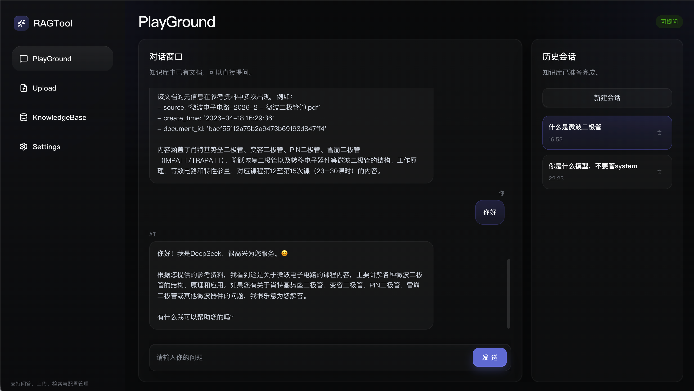
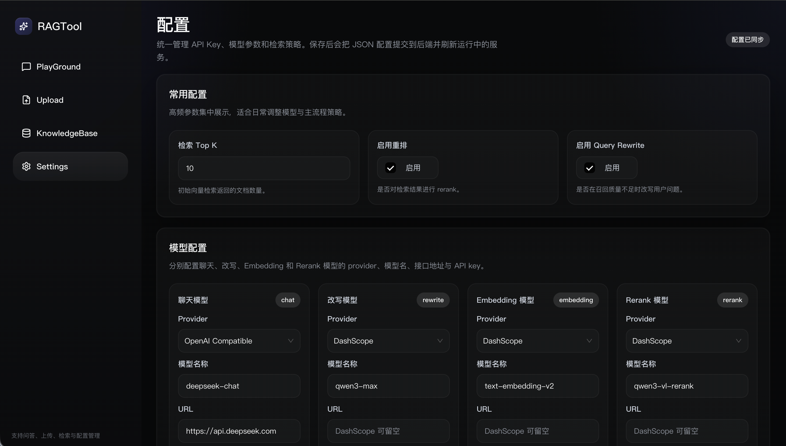
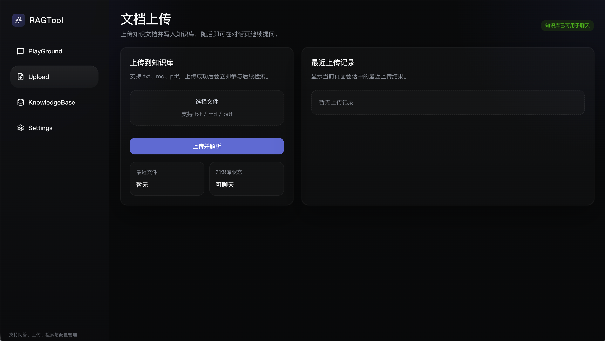
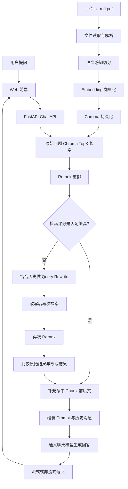

# RAGTool

> 提示：请自行配置Chat,embedding,Rerank,Rewrite模型base-url和API-key，默认使用阿里云百炼平台的DashScope模型

这一个前后端分离的 RAG 示例项目：

- `RAG/`：FastAPI 后端，负责知识库入库、检索、rerank 和对话
- `web/`：Vite + React 前端
- `storage/`：运行时数据目录（知识库、聊天历史、md5 索引）
- `scripts/`：初始化和启动脚手架

## 项目界面预览



### Playground


### Settings



### Upload




## RAG 架构概览

这个项目的 RAG 框架可以概括为：

- 前端：`Vite + React`
- 后端：`FastAPI`
- 向量库：`Chroma`
- Embedding / 对话 / Rerank：`DashScope / 通义模型`
- 历史消息：基于文件的会话存储

它不是一个“只做向量检索”的简单问答系统，而是包含了这些关键环节：

- 文档上传与去重
- 语义感知切分
- 向量化入库
- Query Rewrite
- Top-K 召回
- Rerank
- 命中 chunk 的前后文补齐
- 基于上下文和会话历史的回答生成

### 整体流程图



### 入库链路

知识库写入时，后端会先读取上传文件内容，然后进行更偏语义的切分，而不是只按固定字符长度硬切。之后每个 chunk 会带上 `document_id`、`source`、`chunk_index` 等 metadata 写入 Chroma，便于后续检索、补邻块和文档管理。

可以把入库过程理解成：

```text
上传文件 -> 提取文本 -> 语义切分 -> Embedding -> 写入 Chroma
```

### 查询链路

用户发起提问后，后端会优先使用原始问题进入检索链路，而不是默认先 rewrite。整体流程如下：

1. 先用原始问题做向量召回
2. 对召回结果做 rerank，并根据 `rerank_score` 判断结果质量
3. 如果分数足够高，直接使用当前结果
4. 如果分数不高，再结合最近会话历史做 Query Rewrite，并重新检索与 rerank
5. 比较原始检索结果和 rewrite 后结果，选择更优的一组
6. 对最终命中的 chunk 补齐前后相邻 chunk
7. 把整理后的上下文连同历史消息一起送给聊天模型
8. 返回最终回答

这里有一个很重要的设计点：

- **先 rerank，再补前后 chunk**

也就是说，相邻 chunk 的作用是补足上下文，而不是参与主排序，这样可以尽量减少噪声对排序结果的干扰。

### 核心模块分工

- `RAG/app/services/knowledge_base.py`：知识库入库、分块、去重、删除
- `RAG/app/utils/semantic_chunker.py`：语义感知切分
- `RAG/app/services/vector_store.py`：Chroma 检索与相邻 chunk 扩展
- `RAG/app/services/query_rewrite.py`：查询改写
- `RAG/app/services/rerank.py`：Rerank 封装
- `RAG/app/services/rag.py`：RAG 主编排链路
- `RAG/app/memory/historymessage.py`：会话历史文件存储

### 一句话理解这个项目

这个项目的回答链路可以简化理解为：

```text
用户问题 -> 检索 -> 重排 -> 低分时改写重检 -> 补上下文 -> 生成答案
```

## 目录结构

```text
demo01/
├── RAG/                  # 后端源码
├── web/                  # 前端源码
├── scripts/              # 初始化 / 启动脚本
├── storage/              # 运行时数据（默认不提交）
├── .env.example          # 配置模板
├── requirements.txt      # 后端依赖
└── README.md
```

## 环境要求

- Python 3.11+
- Node.js 20+
- `npm` 或 `pnpm`

## 快速开始

### 1. 克隆项目

```bash
git clone <your-repo-url>
cd demo01
```

### 2. 初始化项目

```bash
python scripts/bootstrap.py
```

这个脚本会自动完成：

- 创建根目录 `.env`
- 创建 `.venv`
- 安装后端依赖
- 安装前端依赖
- 初始化 `storage/` 目录

### 3. 填写配置

打开根目录 `.env`，至少填写：

```env
DASHSCOPE_API_KEY=你的密钥
```

其他配置已经在 `.env.example` 中给出了默认值，可以按需调整。

## 启动项目

### 一键启动前后端

```bash
python scripts/dev.py
```

默认访问地址：

- 前端：http://localhost:5173
- 后端：http://localhost:8000
- 健康检查：http://localhost:8000/health

### 分别启动

```bash
python scripts/start_backend.py
python scripts/start_frontend.py
```

## 配置说明

项目默认优先读取根目录 `.env`，同时兼容旧的 `RAG/.env`。

常用配置：

- `DASHSCOPE_API_KEY`：DashScope API Key
- `EMBEDDING_MODEL_NAME`：Embedding 模型
- `CHAT_MODEL_NAME`：聊天模型
- `RERANK_ENABLED`：是否开启 rerank
- `RERANK_MODEL_NAME`：rerank 模型名
- `RETRIEVE_TOP_K`：初始召回条数
- `RETRIEVAL_NEIGHBOR_CHUNKS`：命中 chunk 前后补充块数
- `PERSIST_DIRECTORY`：Chroma 数据目录
- `CHAT_HISTORY_DIRECTORY`：聊天历史目录
